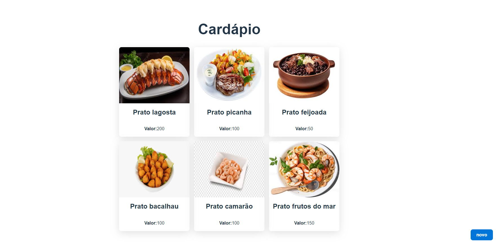

# Cardápio

"Cardápio" é um projeto full stack desenvolvido com o objetivo de aprimorar meus conhecimentos em desenvolvimento de software. Este projeto consiste em um cardápio digital com várias opções de pratos, permitindo operações CRUD (Criar, Ler, Atualizar, Deletar) sobre eles.
# Amostra do projeto

# Tecnologias Utilizadas

## Back-end
- **Java Spring Boot**: Usado para configurar o servidor e a lógica de negócios.
- **PostgreSQL**: Banco de dados para armazenar informações dos pratos.
- **Spring Data JPA**: Facilita o acesso e a manipulação dos dados.
- **Flyway**: Gerencia as migrações do banco de dados para manter a estrutura atualizada.

## Front-end
- **React**: Framework utilizado para construir a interface do usuário.
- **Typescript**: Adiciona tipagem estática para melhorar a manutenibilidade do código.
- **Axios**: Biblioteca para realizar requisições HTTP ao back-end.
- **React Query**: Utilizado para buscar, armazenar em cache, sincronizar e atualizar o estado do servidor.

## Configuração do Back-end
Navegue até a pasta back-end.
Execute o comando mvn install para baixar as dependências Maven necessárias para o projeto.
Configuração do Front-end
Navegue até a pasta frontend.
Execute o comando npm install para instalar todas as dependências necessárias.
Executando o Projeto
Back-end
Dentro da pasta back-end, execute:

mvn spring-boot:run
Isso irá iniciar o servidor na porta padrão 8080.

## Front-end
Dentro da pasta frontend, execute:

npm i
Isso irá instalar as dependências.

Dentro da pasta frontend na pasta src, execute:

npm run dev
